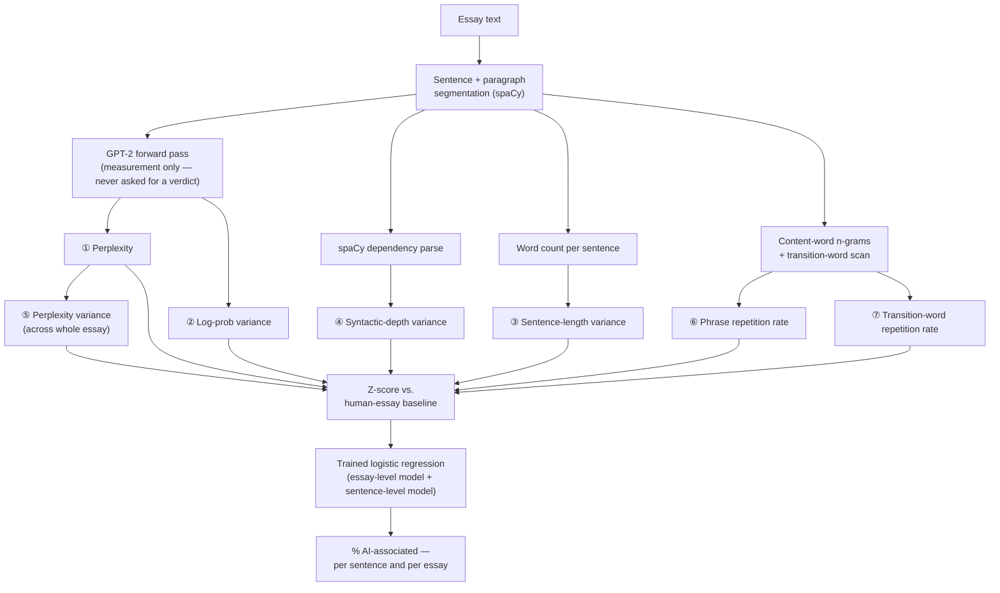
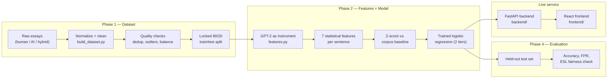
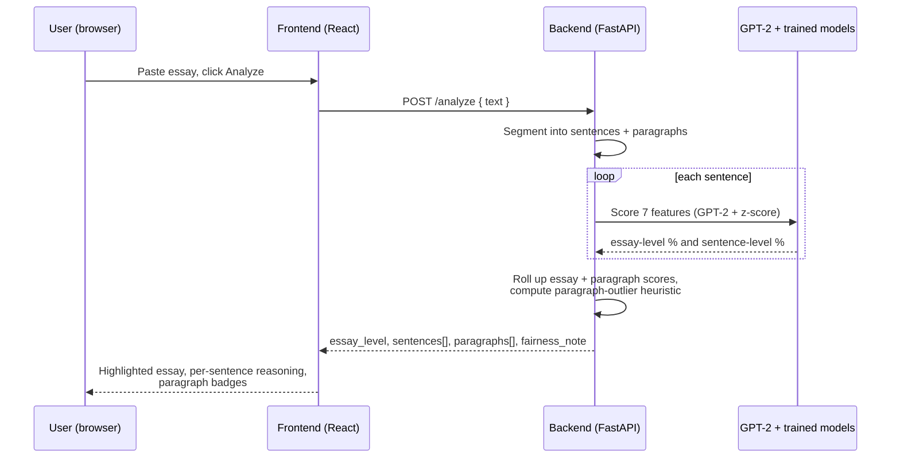

# AI Essay Detector

A tool for college admissions essays that shows **where** a piece of writing looks
AI-associated and **why** — not a black-box percentage. Paste an essay, get every
sentence and paragraph highlighted, and click through to the actual statistical
evidence behind each flag.

No chat model is ever asked "is this AI?" and no verdict is ever relayed from one.
Every score comes from measurable, explainable statistics about the text itself,
combined by a small logistic regression model whose coefficients are fully visible —
see [How this was built](#how-this-was-built) below.

<p align="center">
  
  
</p>

---

## The 7 features we extract

No feature here comes from asking an LLM "does this look AI?" — every one is a plain
statistic computed off GPT-2's raw token probabilities, a spaCy dependency parse, or word
counting. Nothing here is hidden inside a black box.

<table>
<tr>
<td width="60" align="center" valign="middle"><h1>1</h1></td>
<td><b>Word predictability</b> — <i>perplexity</i><br/>How surprising GPT-2 found the sentence's word choices</td>
</tr>
<tr>
<td align="center" valign="middle"><h1>2</h1></td>
<td><b>Predictability swings</b> — <i>token log-prob variance</i><br/>How much that surprise level jumps around within one sentence</td>
</tr>
<tr>
<td align="center" valign="middle"><h1>3</h1></td>
<td><b>Sentence-length variation</b> — <i>burstiness</i><br/>How much sentence length varies across the essay</td>
</tr>
<tr>
<td align="center" valign="middle"><h1>4</h1></td>
<td><b>Grammatical-complexity variation</b> — <i>syntactic depth variance</i><br/>How much dependency-parse-tree depth varies sentence to sentence</td>
</tr>
<tr>
<td align="center" valign="middle"><h1>5</h1></td>
<td><b>Word-choice variation</b> — <i>perplexity variance</i><br/>How much word-choice predictability varies across the whole essay</td>
</tr>
<tr>
<td align="center" valign="middle"><h1>6</h1></td>
<td><b>Phrase repetition</b> — <i>n-gram repeat rate</i><br/>How often the same short bigram/trigram recurs across the essay</td>
</tr>
<tr>
<td align="center" valign="middle"><h1>7</h1></td>
<td><b>Transition-word repetition</b><br/>How often the same connector ("however," "moreover") recurs</td>
</tr>
</table>

Each raw number is z-scored against a fixed human-essay baseline, then combined by a
**trained** (not hand-tuned) logistic regression — the model learned which of the 7
measures actually separate human from AI writing from thousands of labeled examples, and
every coefficient it learned is visible and explainable per sentence in the app.

### How text becomes those 7 numbers



## Why two scores, not one

Five of the seven measures above are only meaningful averaged across a *whole* essay —
they're properties of the whole piece of writing, not one sentence. That creates a real
blind spot: a single AI-polished paragraph inside an otherwise-human essay can get
"outvoted" by the genuinely human paragraphs around it. So the app shows two
independent signals (see [`EVALUATION.md`](EVALUATION.md) for the full numbers behind
both):

- **The main, whole-essay check** — strong: 99.95% sentence-level / 100% essay-level
  accuracy on fully AI-written essays, ~83-85% on genuine human essays.
- **A second, weaker, sentence-only check** — built specifically to catch one AI-edited
  sentence hiding inside a human essay (76% recall on that exact case), at the cost of a
  much higher false-positive rate (56%, rising to 77% on non-native English writing) —
  always shown as a secondary signal, never the headline number.

Both are surfaced honestly, including their real, tested error rates — not smoothed over.

## Pipeline overview



## One request, end to end



## Results, honestly

From [`EVALUATION.md`](EVALUATION.md)'s held-out test set (never touched before final evaluation):

| | Accuracy | Notes |
|---|---|---|
| Essay-level model, sentence-level | 82.73% | human 83.52%, ai 99.95%, ai_edited 19.54% (expected — see below) |
| Essay-level model, whole-essay verdict | 65.00% | human 80%, ai 100%, hybrid 15% (a hybrid essay is majority-human text by sentence count, so averaging correctly leans "human" — this model was never meant to catch hybrids alone) |
| Sentence-level model | 58.43% | ai_edited recall 76.09% — the model built specifically for the "AI-edited sentence hidden in a human essay" case |

**A real fairness gap exists and is disclosed, not hidden**: false-positive rates on
non-native English (ESL) writing are roughly double the essay-level model's rate on
ordinary human writing, and severe for the sentence-level model (56% → 77%). This tool
should not be used as the sole basis for a decision about an ESL writer — see the
fairness note shown directly in the app.

## How this was built

Every step — every bug found and fixed, every experiment that failed, every honest
negative result — is documented in full:

| Document | Covers |
|---|---|
| [`PHASE1_PROCESS.md`](PHASE1_PROCESS.md) | Building the 296-essay dataset: sourcing, cleaning, splitting |
| [`dataset/DATASET.md`](dataset/DATASET.md) | The dataset's final schema, counts, and known limitations |
| [`PHASE2_PROCESS.md`](PHASE2_PROCESS.md) | Feature extraction, model training, and the central discovery (essay-wide features blind the model to AI-edited sentences) |
| [`EVALUATION.md`](EVALUATION.md) | Held-out test-set results, 4 confidently-wrong examples explained, the ESL fairness check |
| [`backend/README.md`](backend/README.md) | The API's response shape, field-by-field |
| In-app "How this tool actually works" | A plain-language retelling of all of the above, no stats background assumed — shown at the top of the live app |

**Human essays have mixed provenance, corrected in this documentation pass**: 28 of the
100 `human`-class essays are self-collected student submissions; the other 72 come from
the public essay collection at [openessays.org](https://www.openessays.org/) — see
`dataset/DATASET.md` for the full, verified breakdown (earlier drafts of that document
inaccurately described the whole class as self-collected).

## Project structure

```
naren-yashwanth-N/
├── README.md                    this file
├── requirements.txt              Python dependencies (pip install -r requirements.txt)
├── PHASE1_PROCESS.md            how the dataset was built
├── PHASE2_PROCESS.md            how the features + models were built
├── EVALUATION.md                held-out test results, honestly reported
│
├── Class A/                     raw AI-written essays (100)
├── Class A_v2/                  newer AI essays with full generation provenance logged
├── class H/                     raw human essays (100 — mixed provenance, see DATASET.md)
├── class AH/                    raw hybrid essays (human + AI-polished)
├── class AH_original_backup/    pre-regeneration hybrid essays, kept for audit
├── experiment_hybrids/          Phase 2 diagnostic experiment output (not production data)
├── legacy_raw_data_setup/       pre-Phase-1 one-off scripts, archived (see its own README)
│
├── dataset/                     essays.jsonl, corpus_baseline.json, splits.json, reports
├── scripts/                     the full Phase 1 + Phase 2 pipeline (all reusable/re-runnable)
│
├── backend/                     FastAPI inference service (wraps scripts/, no reimplementation)
│   ├── main.py                  HTTP endpoints
│   ├── pipeline.py              the full per-request analysis pipeline
│   └── model_loader.py          loads GPT-2 + both trained models once at startup
│
├── frontend/                    React + Vite UI
│   └── src/
│       ├── App.jsx              top-level state/layout
│       ├── api.js                the only place that talks to the backend
│       └── components/          one component per results-view section
│
└── docs/screenshots/            images used in this README
```

## Running it locally

**Backend** (Python 3.12):

```bash
pip install -r requirements.txt
python -m spacy download en_core_web_sm   # separate step - not a normal pip package

cd backend
python -m uvicorn main:app --host 127.0.0.1 --port 8000
```

First startup downloads GPT-2 from Hugging Face (~500MB, needs internet, one-time - cached
locally after that), then loads it plus spaCy and both trained models — takes a few
seconds to a couple minutes depending on connection. Confirm with `GET /health` before
sending real traffic. See `requirements.txt` for a note on a real `torch` install issue
hit during this project's own setup, and `backend/README.md` for the full API response
shape.

**Frontend** (Node.js):

```bash
cd frontend
npm install
npm run dev
```

Open `http://localhost:5173`. The frontend expects the backend at `127.0.0.1:8000` (see
`frontend/src/api.js`).

## Model backend: local GPT-2 (default) vs. Hugging Face Inference API

GPT-2 is used purely as a measurement instrument throughout this project (see
[What this tool is not](#what-this-tool-is-not) below) — it never produces a verdict,
only per-token log-probabilities that `scripts/features.py` turns into statistics. There
are two ways to run that measurement step, and this repo supports both, but only one is
wired up and running by default:

1. **Local model (active, default)** — GPT-2 loaded once in-process via `transformers`/
   `torch` (`scripts/features.py`'s `get_model()`). No API key, no per-request network
   call, no external dependency beyond the one-time model download. This is what runs
   when you follow "Running it locally" above, unmodified.
2. **Hugging Face Inference API (documented, inactive)** — the same `"gpt2"` checkpoint,
   scored via Hugging Face's hosted API instead of a local forward pass. A full reference
   implementation exists in `scripts/features.py`, immediately below
   `sentence_token_logprobs()`, clearly delimited between `ALTERNATIVE MODEL BACKEND
   (INACTIVE)` markers — **entirely commented out, never executed**. To actually use it:
   uncomment that block, add `import os` to the file's imports, `pip install
   huggingface_hub`, set an `HF_API_TOKEN` environment variable (free, from
   [huggingface.co/settings/tokens](https://huggingface.co/settings/tokens)), and change
   the call site to use `sentence_token_logprobs_hf_api()` instead of
   `sentence_token_logprobs()`. The reference implementation's own comments spell out one
   real, unresolved gap (context/sentence token-boundary alignment) and one real tradeoff
   (per-sentence network latency) — it's a documented starting point, not a drop-in,
   pre-verified swap.

Same underlying model either way, so switching shouldn't require retraining — but that
equivalence hasn't been verified end-to-end, so treat it as a real check to do, not an
assumption, before trusting API-backed scores against the numbers in `EVALUATION.md`.

## What this tool is not

- **Not a verdict.** Every score is framed as "shows patterns statistically associated
  with..." never "this essay IS...". A statistical signal, not a determination.
- **Not a chat-model wrapper.** No LLM is ever asked to judge the text directly — GPT-2
  is used only to measure token-level predictability; the actual judgment comes from a
  transparent, trained logistic regression over 7 measurable features.
- **Not perfect, and says so.** The known weak spots (AI-edited sentences hidden in a
  human essay, reduced accuracy on ESL writing) are surfaced directly in the app and
  documented in full in `EVALUATION.md`, not buried in a footnote.
