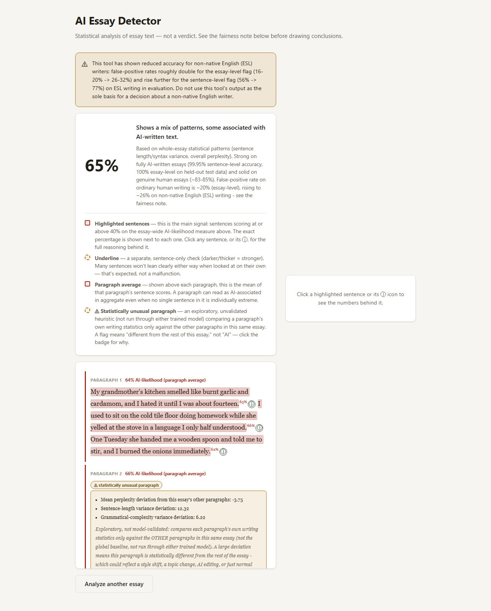
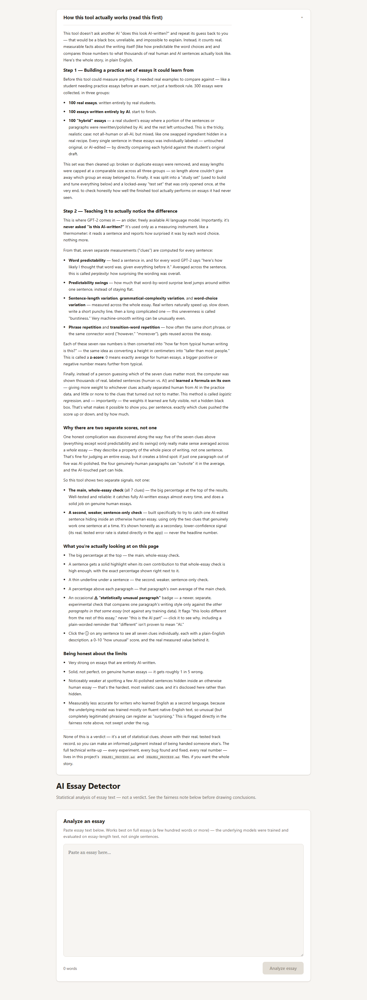
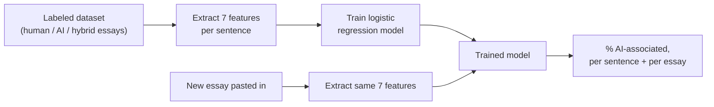

# AI Essay Detector

A tool that checks a college admissions essay for signs of AI writing — and shows
**exactly why**, sentence by sentence, instead of a single black-box score.

No chat model is ever asked "is this AI?". Every score comes from measurable statistics
about the text, scored by a small logistic regression model **trained on our own labeled
dataset** of human, AI, and hybrid essays.

<p align="center">
  
  
</p>

---

## How it works



## The 7 features it extracts

<table>
<tr><td width="40" align="center"><h2>1</h2></td><td><b>Word predictability</b> — how surprising GPT-2 found the word choices</td></tr>
<tr><td align="center"><h2>2</h2></td><td><b>Predictability swings</b> — how much that surprise jumps around within a sentence</td></tr>
<tr><td align="center"><h2>3</h2></td><td><b>Sentence-length variation</b> — how much sentence length varies across the essay</td></tr>
<tr><td align="center"><h2>4</h2></td><td><b>Grammatical-complexity variation</b> — how much sentence structure varies</td></tr>
<tr><td align="center"><h2>5</h2></td><td><b>Word-choice variation</b> — how much predictability varies across the essay</td></tr>
<tr><td align="center"><h2>6</h2></td><td><b>Phrase repetition</b> — how often the same short phrase repeats</td></tr>
<tr><td align="center"><h2>7</h2></td><td><b>Transition-word repetition</b> — how often words like "however" repeat</td></tr>
</table>

## The proof

Trained and tested on our own dataset of **296 essays** (human, AI, and hybrid),
held-out test results from [`EVALUATION.md`](EVALUATION.md):

| Check | Accuracy |
|---|---|
| AI-written essays | 99.95% sentence-level / 100% essay-level |
| Genuine human essays | ~83–85% |
| AI-edited sentence hidden in a human essay | 76% recall (weaker secondary check) |

Full training process, dataset breakdown, and honest error rates (including a known
fairness gap on non-native English writing) are documented in:

- [`PHASE1_PROCESS.md`](PHASE1_PROCESS.md) — how the dataset was built
- [`PHASE2_PROCESS.md`](PHASE2_PROCESS.md) — how the features + model were trained
- [`EVALUATION.md`](EVALUATION.md) — full held-out test results
- [`dataset/DATASET.md`](dataset/DATASET.md) — dataset schema and counts

## Project structure

```
├── backend/     FastAPI service that runs the trained model
├── frontend/    React UI
├── scripts/     dataset build + feature extraction + training pipeline
├── dataset/     the labeled dataset and trained model files
└── docs/        screenshots used in this README
```

## Running it locally

**Backend** (Python 3.12):

```bash
pip install -r requirements.txt
python -m spacy download en_core_web_sm

cd backend
python -m uvicorn main:app --host 127.0.0.1 --port 8000
```

**Frontend** (Node.js):

```bash
cd frontend
npm install
npm run dev
```

Open `http://localhost:5173`. Full API details in [`backend/README.md`](backend/README.md).

## What this tool is not

- **Not a verdict** — every score is a statistical signal, not "this essay IS AI".
- **Not a chat-model wrapper** — GPT-2 only measures word predictability; the judgment
  comes from the trained logistic regression.
- **Not perfect** — known weak spots are disclosed in [`EVALUATION.md`](EVALUATION.md),
  not hidden.
